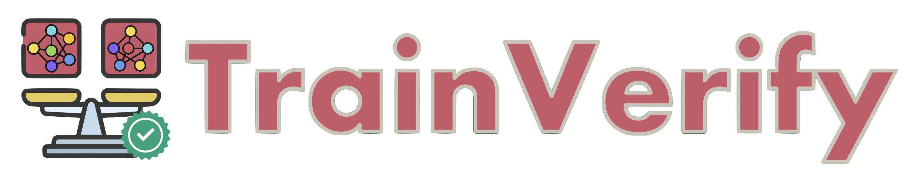
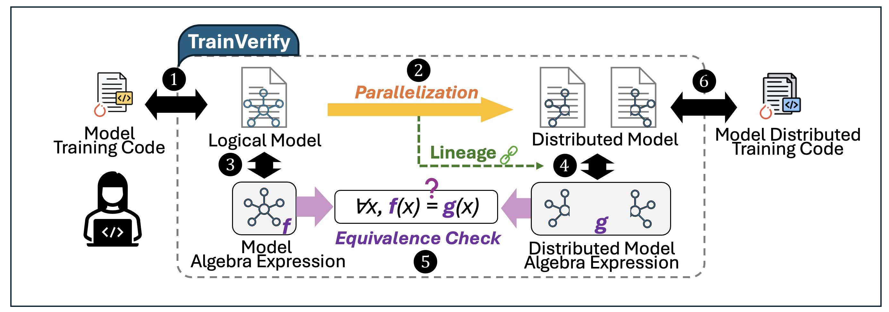
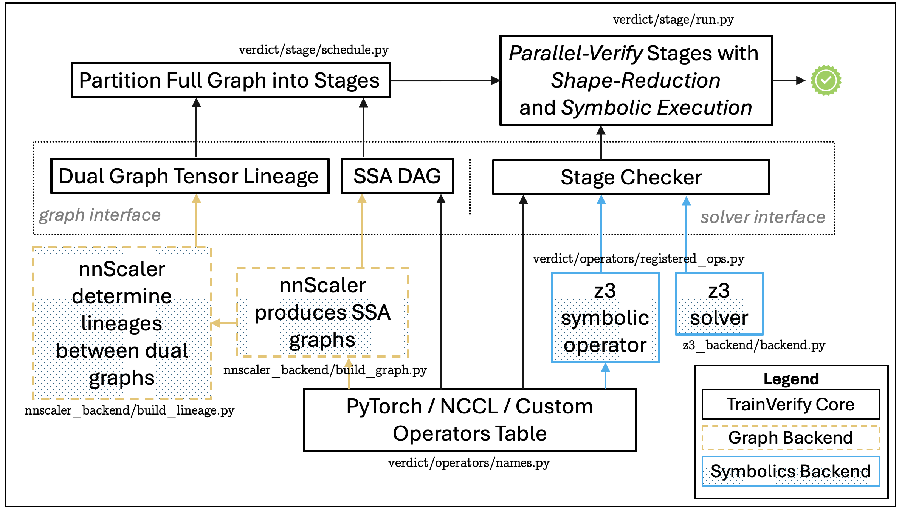

<div align="center">

</div>
<h2 align="center">Equivalence-Based Verification  for Distributed LLM Training</h2>


**TrainVerify** is a verification tool for ensuring *parallelization equivalence* in distributed model training. It operates on computation graphs, and guarantees that the parallelized model is arithmetically equivalent to its original single-device version, thereby eliminating errors such as incorrect tensor transformations or faulty collective communication introduced during parallelization.

# What It Does
**Workflow:** TrainVerify takes the execution plans (execplans) of both the original (single-device) and parallelized (multi-device) models, each enriched with lineages. It then transforms them into symbolic SSA DAGs (single-static assignment directed acyclic graphs). The dual graphs are partitioned into independent stages using lineage information. Each stage, which is expected to hold equivalent computation, undergoes parallel execution, where shape reduction is applied, followed by symbolic verification using Z3. If all stages pass, TrainVerify guarantees end-to-end equivalence.
<div align="center">

</div>

**Implementation:** TrainVerify is implemented with modular interfaces. It defines a general graph interface and a solver interface, supporting a registry of allowable operators. The [nnScaler](https://github.com/microsoft/nnscaler) backend constructs SSA DAGs that conform to our requirements. A high-level view of the implementation is shown below:
<div align="center">

</div>

For more detail, please check our [paper](TBA).

# 🚀 Try TrainVerify
You can follow our [Quick Start Tutorial](docs/quickstart.md) to set up the environment.

Then explore the [Artifact](https://github.com/verify-llm/TrainVerify/tree/ae)—especially the Bug Reproduction section—to see how TrainVerify detects real-world issues.

# Status
TrainVerify is under active development. For support, please open a GitHub issue or contact us via [email](mailto:verifyllm@gmail.com). We’d love to hear your feedback and welcome contributions from early adopters.

# Contributing

This project welcomes contributions and suggestions.  Please see [🗺️ Dev Roadmap](docs/roadmap.md) for our plans.

Most contributions require you to agree to a
Contributor License Agreement (CLA) declaring that you have the right to, and actually do, grant us
the rights to use your contribution. For details, visit [Contributor License Agreements](https://cla.opensource.microsoft.com). This project has adopted the [Microsoft Open Source Code of Conduct](https://opensource.microsoft.com/codeofconduct/).
For more information see the [Code of Conduct FAQ](https://opensource.microsoft.com/codeofconduct/faq/) or
contact [opencode@microsoft.com](mailto:opencode@microsoft.com) with any additional questions or comments.


# Citation
If TrainVerify is relevant to your work, please cite our paper:
```
@article{lu2025trainverify,
  title={TrainVerify: Equivalence-Based Verification for Distributed LLM Training},
  author={Lu, Yunchi and Miao, Youshan and Tan, Cheng and Huang, Peng and Zhu, Yi and Zhang, Xian and Yang, Fan},  
  booktitle={Proceedings of the ACM SIGOPS 31st Symposium on Operating Systems Principles (SOSP'25)},
  year={2025}
}
```

# License
TrainVerify is licensed under the [MIT License](License).

# Trademarks
This project may contain trademarks or logos for projects, products, or services. Authorized use of Microsoft
trademarks or logos is subject to and must follow
[Microsoft's Trademark & Brand Guidelines](https://www.microsoft.com/legal/intellectualproperty/trademarks/usage/general).
Use of Microsoft trademarks or logos in modified versions of this project must not cause confusion or imply Microsoft sponsorship.
Any use of third-party trademarks or logos are subject to those third-party's policies.

